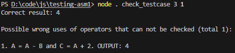

# Software Testing and Reliability - SWE30009: Assignment 1 Testing Program
This program is used to test the program given by the assignment 1 of the course Software Testing and Reliability - SWE30009
## The program to be tested: 
INPUT: A and B

OPERATION:

A = A - B

C = A * 2

OUTPUT: C
# Usages
## Check a single testcase
Check if a testcase (A,B) cannot detect any possible wrong use algorithmic operators (+, -, *, /) for the given program:
> node . check_testcase [A] [B]

Example output:

## Find concrete testcases
Find all possible testcases (A,B) for the ranges start_a <= A <= end_a and start_b <= B <= end_b:
> node . find_concrete [start_a] [end_a] [start_b] [end_b]

Example output:

